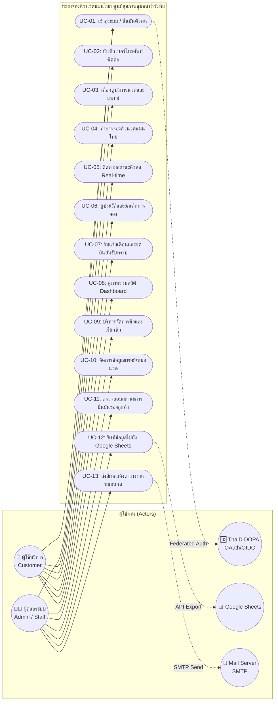
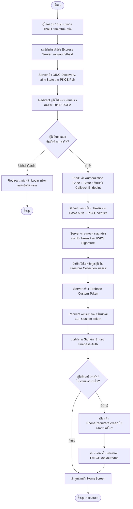
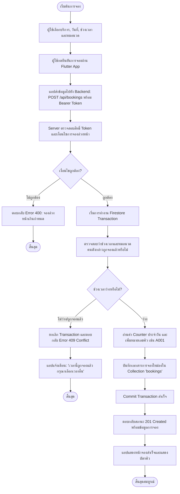
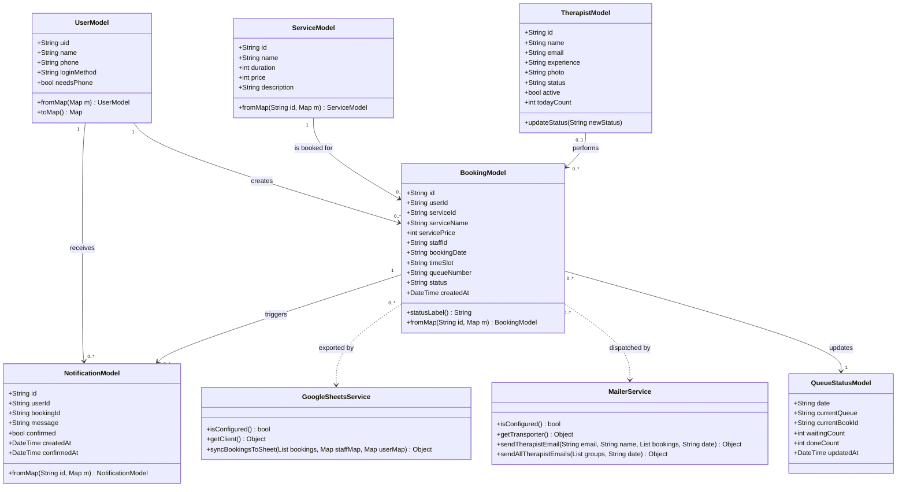
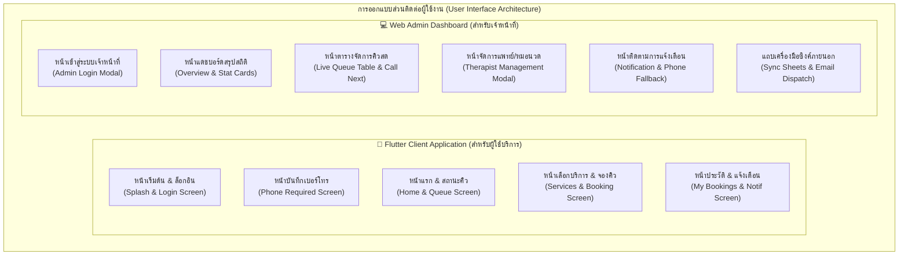

# บทที่ 3
# การวิเคราะห์และออกแบบระบบ (System Analysis and Design)

การพัฒนาระบบจองคิวนวดแผนไทย ศูนย์สุขภาพชุมชนท่าวังหิน มีเป้าหมายเพื่อสร้างระบบบริหารจัดการการจองคิวและนัดหมายการให้บริการนวดแผนไทยอย่างมีประสิทธิภาพ ครอบคลุมทั้งแอปพลิเคชันสำหรับประชาชนผู้รับบริการ (Flutter Cross-Platform Application) และระบบบริหารจัดการสำหรับเจ้าหน้าที่ (Web Admin Dashboard) เชื่อมต่อการทำงานผ่าน RESTful API ด้วย Node.js / Express และจัดเก็บข้อมูลบนฐานข้อมูล Cloud Firestore

ในบทนี้จะนำเสนอรายละเอียดการวิเคราะห์และออกแบบระบบตามหลักวิศวกรรมซอฟต์แวร์ ประกอบด้วย:
1. การวิเคราะห์ความต้องการของระบบ (Requirement Analysis)
2. แผนภาพกรณีการใช้งานและรายละเอียดกรณีการใช้งาน (Use Case Diagram & Descriptions)
3. ผังแสดงลำดับขั้นตอนการทำงาน (Activity Diagrams)
4. แผนภาพคลาส (Class Diagram)
5. การออกแบบโครงสร้างฐานข้อมูล (Database Schema / Firestore Collections)
6. การออกแบบส่วนติดต่อผู้ใช้งาน (User Interface Design)

---

## 3.1 การวิเคราะห์ความต้องการของระบบ (Requirement Analysis)

จากการศึกษากระบวนการให้บริการนวดแผนไทยของศูนย์สุขภาพชุมชนท่าวังหิน ได้จำแนกความต้องการของระบบออกเป็น 2 ด้านหลัก ดังนี้:

### 3.1.1 ความต้องการเชิงฟังก์ชัน (Functional Requirements)

#### 1. ส่วนของผู้ใช้บริการ (Customer / General User) ผ่านแอปพลิเคชัน Flutter:
* **ระบบยืนยันตัวตน (Authentication):**
  * รองรับการเข้าสู่ระบบด้วย **ThaiD Digital ID (DOPA OpenID Connect)** โดยมีการตรวจสอบความถูกต้องของ ID Token ด้วยกุญแจสาธารณะ (JWKS) และมาตรฐาน PKCE
  * รองรับการเข้าสู่ระบบด้วยหมายเลขโทรศัพท์และรหัสผ่านใช้ครั้งเดียว (Firebase Phone OTP)
* **ระบบบันทึกข้อมูลติดต่อ:**
  * มีระบบบังคับกรอกหมายเลขโทรศัพท์สำหรับผู้ใช้งานที่ล็อกอินผ่าน ThaiD เพื่อให้เจ้าหน้าที่สามารถติดต่อสำรองได้ในกรณีเร่งด่วน
* **ระบบสืบค้นและเลือกบริการ (Services Catalog):**
  * แสดงรายการหัตถการนวดแผนไทย รายละเอียด ระยะเวลาในการนวด และราคาค่าบริการ
* **ระบบจองคิวล่วงหน้า (Booking & Slot Selection):**
  * สามารถเลือกวัน, เวลา, บริการ และระบุแพทย์แผนไทย/หมอนวดที่ต้องการรับบริการได้
  * ระบบมีกลไกตรวจสอบช่วงเวลาว่างแบบ Real-time เพื่อป้องกันการจองเวลาเดียวกันซ้ำซ้อน (Conflict Prevention)
* **ระบบติดตามคิวสด (Live Queue Tracking):**
  * แสดงหมายเลขคิวที่กำลังรับบริการอยู่ในปัจจุบัน
  * แสดงจำนวนคิวที่รอก่อนหน้า และเวลาคาดการณ์ในการรอรับบริการ
* **ระบบจัดการประวัติการจอง (My Bookings & Cancellation):**
  * ตรวจสอบประวัติการจองและสถานะการจองย้อนหลัง
  * สามารถกดยกเลิกการจองได้ด้วยตนเองตามเงื่อนไขเวลาที่ศูนย์กำหนด
* **ระบบศูนย์การแจ้งเตือนและการยืนยันรับทราบ (Notification & Acknowledgement):**
  * รับการแจ้งเตือนเมื่อถึงคิวหรือมีการเปลี่ยนสถานะการจอง
  * มีปุ่ม "กดยืนยันรับทราบ" เพื่อส่งสัญญาณกลับไปยังเจ้าหน้าที่ว่าผู้รับบริการพร้อมเข้าห้องนวดแล้ว

#### 2. ส่วนของเจ้าหน้าที่และผู้ดูแลระบบ (Admin / Staff) ผ่าน Web Admin Dashboard:
* **ระบบรักษาความปลอดภัยและการเข้าถึง:**
  * เข้าสู่ระบบด้วย Email/Password ผ่านการตรวจสอบสิทธิ์ `admin custom claims` จาก Firebase Authentication
* **แดชบอร์ดสรุปภาพรวม (Dashboard Overview):**
  * แสดงการ์ดสถิติแบบเรียลไทม์: จำนวนการจองวันนี้, คิวที่รอยืนยัน, คิวที่กำลังรับบริการ, คิวที่เสร็จสิ้น และจำนวนหมอนวดทั้งหมด
* **ระบบจัดการคิวงานและการให้บริการ (Queue Management):**
  * มีปุ่มเรียกคิวถัดไป (Call Next) แบบอัตโนมัติ
  * สามารถปรับเปลี่ยนสถานะการจองได้ (`pending` $\rightarrow$ `confirmed` $\rightarrow$ `in_service` $\rightarrow$ `done` $\rightarrow$ `cancelled`)
* **ระบบจัดการข้อมูลแพทย์แผนไทย/หมอนวด (Therapist Management):**
  * เพิ่ม ลบ แก้ไข ข้อมูลหมอนวด (ชื่อ-นามสกุล, อีเมล, ประสบการณ์, URL รูปถ่าย)
  * ปรับเปลี่ยนสถานะการปฏิบัติงาน (`พร้อมให้บริการ`, `กำลังให้บริการ`, `พักเบรก`, `ลา/หยุดงาน`)
* **ระบบตรวจสอบการแจ้งเตือนลูกค้า (Notification Fallback Monitoring):**
  * แสดงรายการแจ้งเตือนที่ส่งหาลูกค้า พร้อมระบุสถานะว่า "ลูกค้ารับทราบแล้ว" หรือ "ยังไม่ยืนยัน"
  * แสดงเบอร์โทรศัพท์ของลูกค้าทันที เพื่อให้เจ้าหน้าที่สามารถโทรติดต่อได้โดยตรงหากแอปพลิเคชันแจ้งเตือนไม่ถึง
* **ระบบส่งออกข้อมูลไปยัง Google Sheets (Google Sheets Integration):**
  * ซิงค์ข้อมูลรายการจองทั้งหมดไปยัง Google Spreadsheet อัตโนมัติ เพื่อนำไปจัดทำสถิติและรายงานประจำเดือน
* **ระบบส่งอีเมลแจ้งตารางงานหมอนวด (Therapist Email Dispatch):**
  * รวบรวมคิวงานประจำวันและส่งอีเมลแจ้งตารางเวลาให้หมอนวดแต่ละคนแยกตามรายบุคคลผ่าน Gmail SMTP

---

### 3.1.2 ความต้องการเชิงไม่เกี่ยวข้องกับฟังก์ชัน (Non-Functional Requirements)

1. **ด้านความปลอดภัย (Security):**
   * ระบบยืนยันตัวตนดิจิทัลผ่าน ThaiD รองรับมาตรฐาน OpenID Connect (OIDC) พร้อมระบบตรวจสอบ JWKS Signature และ PKCE S256
   * ป้องกันระบบ API ด้วย `helmet` (HTTP Security Headers) และ `express-rate-limit` เพื่อป้องกันการโจมตีแบบ Brute-Force
   * มีระบบ Firestore Security Rules เพื่อจำกัดสิทธิ์การอ่าน-เขียนข้อมูลเฉพาะผู้ที่มีสิทธิ์เท่านั้น
2. **ด้านความถูกต้องและภาวะพร้อมกันของข้อมูล (Data Integrity & Concurrency):**
   * ใช้ **Firestore Transaction** ในขั้นตอนการสร้างการจองคิว เพื่อป้องกันปัญหา Race Condition และการจองทับซ้อน (Double Booking)
   * มีระบบออกหมายเลขคิวประจำวันแบบอัตโนมัติ (เช่น A001, A002) อย่างต่อเนื่องและไม่ซ้ำซ้อน
3. **ด้านความเข้ากันได้และการตอบสนอง (Cross-Platform & Usability):**
   * แอปพลิเคชันฝั่งผู้ใช้พัฒนาด้วย Flutter รองรับการทำงานทั้งบนระบบปฏิบัติการ Android, iOS และ Web Browser
   * หน้าจอ Web Admin ออกแบบด้วย CSS สไตล์ Jade-Forest ให้ความสวยงาม สบายตา ใช้งานง่ายบนหน้าจอ Desktop และ Tablet
4. **ด้านความพร้อมใช้งานและประสิทธิภาพ (Availability & Performance):**
   * ฝั่ง Backend สามารถ Deploy เป็น Web Service (Render/Cloud Run) หรือ Serverless Firebase Cloud Functions (Region: `asia-southeast1`) เพื่อการตอบสนองที่รวดเร็ว

---

## 3.2 แผนภาพกรณีการใช้งาน (Use Case Diagram)

แผนภาพกรณีการใช้งานแสดงการมีปฏิสัมพันธ์ระหว่างผู้ใช้งานระบบกับฟังก์ชันการทำงานหลัก:



---

## 3.3 รายละเอียดกรณีการใช้งาน (Use Case Descriptions)

---

### ตารางที่ 3.1: Use Case Description — UC-01: การเข้าสู่ระบบและยืนยันตัวตน (Authentication)

| รายการ | รายละเอียด |
| :--- | :--- |
| **รหัสกรณีการใช้งาน** | UC-01 |
| **ชื่อกรณีการใช้งาน** | การเข้าสู่ระบบและยืนยันตัวตน (Authentication) |
| **ผู้กระทำ (Actor)** | ผู้ใช้บริการ (Customer), ผู้ดูแลระบบ (Admin), ระบบ ThaiD DOPA |
| **วัตถุประสงค์** | เพื่อระบุตัวตนของผู้ใช้งานและออก Token สิทธิ์การเข้าถึงระบบที่ปลอดภัย |
| **เงื่อนไขก่อนทำ (Pre-conditions)** | ผู้ใช้งานเปิดแอปพลิเคชัน Flutter หรือเปิดหน้า Web Admin Dashboard |
| **เงื่อนไขหลังทำ (Post-conditions)** | ผู้ใช้ได้รับ Token ยืนยันตัวตน และระบบนำเข้าสู่หน้าจอตามบทบาทที่ได้รับอนุญาต |
| **ขั้นตอนการทำงานหลัก (Main Flow)** | 1. ผู้ใช้เลือกวิธีการเข้าสู่ระบบ (ThaiD Digital ID, เบอร์โทรศัพท์ OTP หรือ บัญชีผู้ดูแลระบบ)<br>2. **กรณี ThaiD:** ระบบนำผู้ใช้ไปยังหน้า Authen ของ ThaiD DOPA $\rightarrow$ ตรวจสอบ JWKS Signature $\rightarrow$ บันทึกข้อมูลและสร้าง Firebase Custom Token $\rightarrow$ นำผู้ใช้กลับเข้าสู่แอปพลิเคชัน<br>3. **กรณี Phone OTP:** ผู้ใช้กรอกเบอร์โทร $\rightarrow$ รับรหัส OTP ทาง SMS $\rightarrow$ กรอกรหัส 6 หลักยืนยัน<br>4. **กรณี Admin:** เจ้าหน้าที่กรอก Email และ Password $\rightarrow$ ระบบตรวจสอบ Claim สิทธิ์ `admin: true`<br>5. ระบบบันทึกสถานะการล็อกอินและนำผู้ใช้เข้าสู่หน้าจอหลัก |
| **ขั้นตอนสำรอง (Alternative Flow)** | 2a. ผู้ใช้ยกเลิกหรือยืนยันตัวตนผ่าน ThaiD ไม่สำเร็จ: ระบบแจ้งเตือนและกลับมายังหน้าเลือกวิธีเข้าสู่ระบบ<br>4a. รหัสผ่านไม่ถูกต้อง หรือไม่มีสิทธิ์ Admin: ระบบแสดงข้อความปฏิเสธการเข้าถึง |

---

### ตารางที่ 3.2: Use Case Description — UC-02: การบันทึกเบอร์โทรศัพท์ติดต่อ (Phone Number Verification)

| รายการ | รายละเอียด |
| :--- | :--- |
| **รหัสกรณีการใช้งาน** | UC-02 |
| **ชื่อกรณีการใช้งาน** | การบันทึกเบอร์โทรศัพท์ติดต่อ (Phone Number Verification) |
| **ผู้กระทำ (Actor)** | ผู้ใช้บริการ (Customer) |
| **วัตถุประสงค์** | เพื่อจัดเก็บเบอร์โทรศัพท์สำหรับผู้ใช้งานที่ล็อกอินผ่าน ThaiD เพื่อใช้ติดต่อสำรอง |
| **เงื่อนไขก่อนทำ (Pre-conditions)** | ผู้ใช้ล็อกอินผ่าน ThaiD สำเร็จ และระบบตรวจสอบพบว่าฟิลด์ `phone` ยังเป็นค่าว่าง |
| **เงื่อนไขหลังทำ (Post-conditions)** | ข้อมูลเบอร์โทรศัพท์ถูกบันทึกลงในเอกสาร `users` ของผู้ใช้ |
| **ขั้นตอนการทำงานหลัก (Main Flow)** | 1. ระบบนำผู้ใช้ไปยังหน้าจอ `PhoneRequiredScreen` โดยอัตโนมัติ<br>2. ผู้ใช้กรอกหมายเลขโทรศัพท์ 10 หลัก และกดปุ่ม "บันทึกและดำเนินการต่อ"<br>3. แอปพลิเคชันส่ง Request `PATCH /api/auth/me` ไปยัง Server<br>4. Server ตรวจสอบความถูกต้องของรูปแบบเบอร์โทร และบันทึกลง Firestore<br>5. ระบบนำผู้ใช้เข้าสู่หน้าหลักของแอปพลิเคชัน |
| **ขั้นตอนสำรอง (Alternative Flow)** | 2a. ผู้ใช้กรอกเบอร์โทรไม่ครบ 10 หลักหรือไม่ถูกต้อง: ระบบแสดงข้อความแจ้งเตือน "กรุณากรอกเบอร์โทรศัพท์ให้ถูกต้อง" |

---

### ตารางที่ 3.3: Use Case Description — UC-04: การจองคิวนวดแผนไทย (Booking & Slot Validation)

| รายการ | รายละเอียด |
| :--- | :--- |
| **รหัสกรณีการใช้งาน** | UC-04 |
| **ชื่อกรณีการใช้งาน** | การจองคิวนวดแผนไทย (Booking & Slot Validation) |
| **ผู้กระทำ (Actor)** | ผู้ใช้บริการ (Customer) |
| **วัตถุประสงค์** | เพื่อทำการนัดหมายและจองคิวนวดแผนไทยในวันและช่วงเวลาที่ต้องการ |
| **เงื่อนไขก่อนทำ (Pre-conditions)** | ผู้ใช้เข้าสู่ระบบเรียบร้อยแล้ว และมีข้อมูลเบอร์โทรศัพท์ในระบบ |
| **เงื่อนไขหลังทำ (Post-conditions)** | รายการจองถูกบันทึกลงฐานข้อมูล Firestore พร้อมออกหมายเลขคิวประจำวัน |
| **ขั้นตอนการทำงานหลัก (Main Flow)** | 1. ผู้ใช้เลือกรายการบริการนวดแผนไทยที่ต้องการ<br>2. ผู้ใช้เลือกวันที่นัดหมาย (จองล่วงหน้าได้ตามเกณฑ์ที่ศูนย์กำหนด เช่น ไม่เกิน 3 วัน)<br>3. ผู้ใช้เลือกช่วงเวลานัดหมาย (Time Slot) และเลือกแพทย์แผนไทย/หมอนวด<br>4. ผู้ใช้กดปุ่ม "ยืนยันการจองคิว"<br>5. ระบบรัน **Firestore Transaction** เพื่อตรวจเช็คว่าช่วงเวลาและหมอนวดคนดังกล่าวว่างอยู่จริงหรือไม่<br>6. ระบบอ่านค่า Counter ลำดับคิวประจำวัน และออกหมายเลขคิวใหม่ (เช่น A001, A002)<br>7. บันทึกข้อมูลลง Collection `bookings` ด้วยสถานะ `pending`<br>8. แอปพลิเคชันแสดงหน้าจอจองสำเร็จ พร้อมบัตรคิวและรายละเอียดนัดหมาย |
| **ขั้นตอนสำรอง (Alternative Flow)** | 5a. มีผู้ใช้งานท่านอื่นจองช่วงเวลาดังกล่าวไปก่อนแล้ว (HTTP 409 Conflict): ระบบยกเลิก Transaction และแจ้งเตือน "เวลานี้ถูกจองแล้ว กรุณาเลือกช่วงเวลาอื่น" |

---

### ตารางที่ 3.4: Use Case Description — UC-05: การติดตามสถานะคิวสด (Live Queue Tracking)

| รายการ | รายละเอียด |
| :--- | :--- |
| **รหัสกรณีการใช้งาน** | UC-05 |
| **ชื่อกรณีการใช้งาน** | การติดตามสถานะคิวสด (Live Queue Tracking) |
| **ผู้กระทำ (Actor)** | ผู้ใช้บริการ (Customer) |
| **วัตถุประสงค์** | เพื่อให้ผู้รับบริการทราบความคืบหน้าของคิวและวางแผนการเดินทางได้แม่นยำ |
| **เงื่อนไขก่อนทำ (Pre-conditions)** | ผู้ใช้มีรายการจองในวันปัจจุบันที่มีสถานะ `pending` หรือ `confirmed` |
| **เงื่อนไขหลังทำ (Post-conditions)** | แอปพลิเคชันแสดงหมายเลขคิวปัจจุบัน จำนวนคิวก่อนหน้า และเวลาคาดการณ์ |
| **ขั้นตอนการทำงานหลัก (Main Flow)** | 1. ผู้ใช้เปิดหน้าจอ "คิวของฉัน" (Queue Screen)<br>2. แอปพลิเคชันส่ง Request `GET /api/queue/my`<br>3. Server ดึงข้อมูลสถานะคิวล่าสุด และนับจำนวนคิวที่มีเวลานัดหมายก่อนหน้าผู้ใช้<br>4. Server ส่งข้อมูลกลับมายังแอปพลิเคชัน (หมายเลขคิว, คิวก่อนหน้า, เวลาโดยประมาณ)<br>5. แอปพลิเคชันแสดงผลข้อมูลแบบเรียลไทม์ |
| **ขั้นตอนสำรอง (Alternative Flow)** | 2a. ผู้ใช้ไม่มีคิวในวันปัจจุบัน: ระบบแสดงข้อความ "ท่านไม่มีคิวรอรับบริการในวันนี้" พร้อมปุ่มแนะนำให้ไปหน้าจองบริการ |

---

### ตารางที่ 3.5: Use Case Description — UC-07: การรับแจ้งเตือนและกดยืนยันรับทราบ (Notification & Acknowledgement)

| รายการ | รายละเอียด |
| :--- | :--- |
| **รหัสกรณีการใช้งาน** | UC-07 |
| **ชื่อกรณีการใช้งาน** | การรับแจ้งเตือนและกดยืนยันรับทราบ (Notification & Acknowledgement) |
| **ผู้กระทำ (Actor)** | ผู้ใช้บริการ (Customer), ผู้ดูแลระบบ (Admin) |
| **วัตถุประสงค์** | เพื่อแจ้งเตือนลูกค้าเมื่อถึงคิว และให้ลูกค้ายืนยันการรับทราบเพื่อลดภาระการโทรติดตามของเจ้าหน้าที่ |
| **เงื่อนไขก่อนทำ (Pre-conditions)** | เจ้าหน้าที่กดเรียกคิว หรือระบบส่งข้อความแจ้งเตือนหาผู้ใช้ |
| **เงื่อนไขหลังทำ (Post-conditions)** | สถานะการแจ้งเตือนเปลี่ยนเป็น `confirmed: true` พร้อมบันทึกเวลาที่กดยืนยัน |
| **ขั้นตอนการทำงานหลัก (Main Flow)** | 1. เมื่อเจ้าหน้าที่เรียกคิว ระบบสร้าง Notification ลงใน Collection `notifications`<br>2. แอปพลิเคชันแสดง Badge ตัวเลขแจ้งเตือนที่ไอคอนกระดิ่ง<br>3. ผู้ใช้เปิดหน้ารายการแจ้งเตือน และกดปุ่ม **"รับทราบแล้ว"**<br>4. แอปพลิเคชันส่ง Request `POST /api/notifications/:id/confirm`<br>5. Server อัปเดตสถานะ `confirmed: true` ในฐานข้อมูล<br>6. หน้าจอ Web Admin อัปเดตสถานะเป็น "ลูกค้ารับทราบแล้ว" |
| **ขั้นตอนสำรอง (Alternative Flow)** | 3a. ผู้ใช้ไม่ได้เปิดแอปพลิเคชันหรือไม่ได้กดยืนยัน: หน้าจอ Web Admin จะแสดงสถานะ "ยังไม่ยืนยัน" พร้อมแสดงเบอร์โทรศัพท์เพื่อให้เจ้าหน้าที่โทรติดต่อสำรองได้ทันที |

---

### ตารางที่ 3.6: Use Case Description — UC-09: การบริหารจัดการคิวและเรียกคิว (Queue Management & Call Next)

| รายการ | รายละเอียด |
| :--- | :--- |
| **รหัสกรณีการใช้งาน** | UC-09 |
| **ชื่อกรณีการใช้งาน** | การบริหารจัดการคิวและเรียกคิว (Queue Management & Call Next) |
| **ผู้กระทำ (Actor)** | ผู้ดูแลระบบ / เจ้าหน้าที่ (Admin / Staff) |
| **วัตถุประสงค์** | เพื่อบริหารจัดการลำดับคิวประจำวัน และเรียกคิวผู้รับบริการเข้าห้องนวด |
| **เงื่อนไขก่อนทำ (Pre-conditions)** | เจ้าหน้าที่เข้าสู่ระบบ Web Admin Dashboard เรียบร้อยแล้ว |
| **เงื่อนไขหลังทำ (Post-conditions)** | สถานะของคิวถูกปรับเปลี่ยน และระบบส่งการแจ้งเตือนไปยังผู้รับบริการ |
| **ขั้นตอนการทำงานหลัก (Main Flow)** | 1. เจ้าหน้าที่เปิดหน้า "ภาพรวม" หรือหน้า "จัดการคิว"<br>2. เจ้าหน้าที่กดปุ่ม **"เรียกคิวถัดไป (Call Next)"** หรือคลิกเปลี่ยนสถานะที่รายการจอง<br>3. Server ค้นหาคิวถัดไปที่รอนัดหมาย และปรับสถานะเป็น `in_service`<br>4. Server อัปเดตเอกสาร `queue_status` ประจำวัน และสร้างข้อความแจ้งเตือนลง Collection `notifications`<br>5. เมื่อลูกค้ารับบริการเสร็จสิ้น เจ้าหน้าที่กดเปลี่ยนสถานะเป็น `done` |
| **ขั้นตอนสำรอง (Alternative Flow)** | 2a. ไม่มีคิวรอรับบริการในวันดังกล่าว: ระบบแสดงกล่องข้อความแจ้งเตือน "ไม่มีคิวที่รออยู่แล้ว" |

---

### ตารางที่ 3.7: Use Case Description — UC-10: การจัดการข้อมูลแพทย์แผนไทย/หมอนวด (Therapist Management)

| รายการ | รายละเอียด |
| :--- | :--- |
| **รหัสกรณีการใช้งาน** | UC-10 |
| **ชื่อกรณีการใช้งาน** | การจัดการข้อมูลแพทย์แผนไทย/หมอนวด (Therapist Management) |
| **ผู้กระทำ (Actor)** | ผู้ดูแลระบบ (Admin) |
| **วัตถุประสงค์** | เพื่อเพิ่ม แก้ไข ลบข้อมูลหมอนวด และจัดการสถานะความพร้อมในการให้บริการ |
| **เงื่อนไขก่อนทำ (Pre-conditions)** | ผู้ดูแลระบบล็อกอินเข้าสู่ Web Admin Dashboard |
| **เงื่อนไขหลังทำ (Post-conditions)** | ข้อมูลใน Collection `staff` ได้รับการปรับปรุงในฐานข้อมูล |
| **ขั้นตอนการทำงานหลัก (Main Flow)** | 1. เจ้าหน้าที่เปิดแท็บเมนู "แพทย์/หมอนวด"<br>2. เลือกกดปุ่ม "+ เพิ่มหมอนวดใหม่" หรือกดปุ่ม "แก้ไขข้อมูล" ในการ์ดหมอนวดแต่ละคน<br>3. กรอกข้อมูล: ชื่อ-นามสกุล, อีเมล (สำหรับรับตารางงาน), ประสบการณ์ และ URL รูปภาพ<br>4. เลือกปรับสถานะการทำงาน (`พร้อมให้บริการ`, `กำลังให้บริการ`, `พักเบรก`, `ลา/หยุดงาน`)<br>5. กดยืนยันบันทึกข้อมูล $\rightarrow$ ระบบอัปเดตข้อมูลบน Firestore แบบเรียลไทม์ |
| **ขั้นตอนสำรอง (Alternative Flow)** | 3a. รูปแบบอีเมลไม่ถูกต้อง: ระบบแสดงข้อความเตือน "รูปแบบอีเมลไม่ถูกต้อง" และไม่อนุญาตให้บันทึก |

---

### ตารางที่ 3.8: Use Case Description — UC-12: การซิงค์ข้อมูลไปยัง Google Sheets (Google Sheets Synchronization)

| รายการ | รายละเอียด |
| :--- | :--- |
| **รหัสกรณีการใช้งาน** | UC-12 |
| **ชื่อกรณีการใช้งาน** | การซิงค์ข้อมูลไปยัง Google Sheets (Google Sheets Synchronization) |
| **ผู้กระทำ (Actor)** | ผู้ดูแลระบบ (Admin), ระบบ Google Sheets API |
| **วัตถุประสงค์** | เพื่อส่งออกข้อมูลการจองทั้งหมดไปยัง Google Sheets เพื่อจัดทำรายงานสถิติของศูนย์ |
| **เงื่อนไขก่อนทำ (Pre-conditions)** | ตั้งค่า Service Account Credentials และ Spreadsheet ID ในระบบเรียบร้อยแล้ว |
| **เงื่อนไขหลังทำ (Post-conditions)** | แผ่นงาน `Bookings` บน Google Sheets ได้รับการอัปเดตข้อมูลแถวใหม่ล่าสุด |
| **ขั้นตอนการทำงานหลัก (Main Flow)** | 1. ผู้ดูแลระบบกดปุ่ม **"Sync to Google Sheets"** บนแถบด้านบน (Topbar) ของ Web Admin<br>2. Server ดึงข้อมูลการจองทั้งหมด พร้อมจับคู่ชื่อหมอนวดและข้อมูลติดต่อผู้รับบริการ<br>3. Server ทำการ Authentication กับ Google Sheets API v4 ผ่าน Google Service Account JWT<br>4. ระบบเขียนหัวตาราง (Header) และเขียนแถวข้อมูลการจองทั้งหมดลงในสเปรดชีต<br>5. Web Admin แสดงข้อความแจ้งเตือน "ซิงค์ข้อมูลสำเร็จ" พร้อมจำนวนแถวที่ถูกส่งออก |
| **ขั้นตอนสำรอง (Alternative Flow)** | 3a. ขาดการตั้งค่า Environment หรือไม่มีสิทธิ์เข้าถึง Sheet: Server ตอบกลับ Error 500 พร้อมระบุสาเหตุ |

---

### ตารางที่ 3.9: Use Case Description — UC-13: การส่งอีเมลแจ้งตารางงานหมอนวด (Therapist Email Dispatch)

| รายการ | รายละเอียด |
| :--- | :--- |
| **รหัสกรณีการใช้งาน** | UC-13 |
| **ชื่อกรณีการใช้งาน** | การส่งอีเมลแจ้งตารางงานหมอนวด (Therapist Email Dispatch) |
| **ผู้กระทำ (Actor)** | ผู้ดูแลระบบ (Admin), ระบบ Mail Server (Nodemailer / Gmail SMTP) |
| **วัตถุประสงค์** | เพื่อส่งสรุปตารางคิวนัดหมายประจำวันให้แก่หมอนวดแต่ละคนแยกรายบุคคลทางอีเมล |
| **เงื่อนไขก่อนทำ (Pre-conditions)** | หมอนวดมีข้อมูลอีเมลในระบบ และมีคิวการจองในวันที่เลือก |
| **เงื่อนไขหลังทำ (Post-conditions)** | อีเมลสรุปตารางงานถูกส่งเข้ากล่องข้อความของหมอนวดแต่ละคนอย่างถูกต้อง |
| **ขั้นตอนการทำงานหลัก (Main Flow)** | 1. ผู้ดูแลระบบกดปุ่ม **"Email หมอนวด"** บน Web Admin<br>2. Server ดึงรายการจองประจำวัน และจัดกลุ่มข้อมูลแยกตามหมอนวดแต่ละคน (Group by Staff ID)<br>3. ระบบสร้างตาราง HTML สรุปรายการคิว (เวลา, รหัสคิว, บริการ, ชื่อลูกค้า, เบอร์ติดต่อ)<br>4. ส่งอีเมลผ่าน Nodemailer ไปยังอีเมลของหมอนวดแต่ละท่านที่มีคิวงาน<br>5. Web Admin แสดงผลสรุปจำนวนอีเมลที่ส่งสำเร็จ |
| **ขั้นตอนสำรอง (Alternative Flow)** | 2a. หมอนวดคนใดไม่มีคิวในวันดังกล่าว: ระบบจะไม่ส่งอีเมลหาหมอนวดท่านนั้นเพื่อป้องกันความสับสน |

---

## 3.4 ผังแสดงลำดับขั้นตอนการทำงาน (Activity Diagrams)

---

### 3.4.1 ผังการทำงาน: กระบวนการเข้าสู่ระบบผ่าน ThaiD Digital ID (DOPA OIDC)



---

### 3.4.2 ผังการทำงาน: กระบวนการจองคิวนวดแผนไทยและการตรวจสอบคิวซ้ำซ้อน (Transaction Validation)



---

### 3.4.3 ผังการทำงาน: กระบวนการเรียกคิวและการแจ้งเตือนลูกค้ายืนยันรับทราบ

```mermaid
graph TD
    StartQueue([เริ่มกระบวนการเรียกคิว]) --> C1[เจ้าหน้าที่กดปุ่ม 'เรียกคิวถัดไป (Call Next)' บน Web Admin]
    C1 --> C2[Web Admin ส่ง Request: POST /api/queue/call-next]
    C2 --> C3[Server ค้นหาคิวถัดไปของวัน และเปลี่ยนสถานะเป็น in_service]
    C3 --> C4[Server อัปเดต queue_status ประจำวัน]
    C4 --> C5[Server สร้าง Notification บันทึกลง Collection 'notifications']
    C5 --> C6[Web Admin อัปเดตตารางคิวและแสดงสถานะ 'รอลูกค้ายืนยัน']
    C6 --> C7[แอปพลิเคชันลูกค้าตรวจพบแจ้งเตือนใหม่ และแสดง Badge เตือน]
    C7 --> C8{ลูกค้ารับทราบ<br/>และกดปุ่มยืนยัน?}
    C8 -- ลูกค้ากดยืนยัน --> C9[แอปส่ง POST /api/notifications/:id/confirm]
    C9 --> C10[Server อัปเดต confirmed = true]
    C10 --> C11[Web Admin แสดงสถานะ 'ลูกค้ารับทราบแล้ว'] --> EndQ1([สิ้นสุด])
    C8 -- ไม่ได้กดยืนยัน --> C12[Web Admin คงสถานะ 'ยังไม่ยืนยัน']
    C12 --> C13[เจ้าหน้าที่ดูเบอร์โทรศัพท์ลูกค้าบนจอ แล้วโทรติดตามโดยตรง] --> EndQ2([สิ้นสุด])
```

---

## 3.5 แผนภาพคลาส (Class Diagram)

แผนภาพคลาสแสดงโครงสร้างข้อมูล ความสัมพันธ์ แอตทริบิวต์ (Attributes) และฟังก์ชันการทำงาน (Methods) ภายในระบบ:



---

## 3.6 การออกแบบโครงสร้างฐานข้อมูล (Database Schema / Collections)

ระบบใช้ฐานข้อมูล **Google Cloud Firestore (NoSQL Document Store)** ซึ่งมีการออกแบบ Collections และฟิลด์ข้อมูลดังนี้:

### 1. Collection: `users` (ตารางข้อมูลผู้ใช้งาน)
เก็บบัญชีผู้ใช้บริการและข้อมูลติดต่อ

| ฟิลด์ (Field) | ชนิดข้อมูล (Type) | คำอธิบาย | ตัวอย่างข้อมูล |
| :--- | :--- | :--- | :--- |
| `uid` (Doc ID) | String | รหัสประจำตัวผู้ใช้งาน (Firebase UID / `thaid_PID`) | `"thaid_1349900xxxxxx"` |
| `pid` | String (Optional) | เลขบัตรประจำตัวประชาชน 13 หลัก (จาก ThaiD) | `"1349900876543"` |
| `name` | String | ชื่อ-นามสกุลของผู้ใช้ | `"นายสมชาย ใจดี"` |
| `phone` | String | เบอร์โทรศัพท์สำหรับติดต่อ | `"0812345678"` |
| `loginMethod` | String | วิธีการล็อกอิน (`thaid` \| `phone`) | `"thaid"` |
| `updatedAt` | Timestamp | วันและเวลาที่อัปเดตข้อมูลล่าสุด | `2026-08-01 09:30:00` |

---

### 2. Collection: `services` (ตารางข้อมูลบริการนวด)
เก็บรายละเอียดแพ็กเกจการให้บริการนวดแผนไทย

| ฟิลด์ (Field) | ชนิดข้อมูล (Type) | คำอธิบาย | ตัวอย่างข้อมูล |
| :--- | :--- | :--- | :--- |
| `id` (Doc ID) | String | รหัสบริการนวด | `"thai-massage-60"` |
| `name` | String | ชื่อบริการ | `"นวดแผนไทยเพื่อสุขภาพ"` |
| `duration` | Number (Int) | ระยะเวลาการให้บริการ (นาที) | `60` |
| `price` | Number (Int) | ราคาค่าบริการ (บาท) | `250` |
| `description` | String | รายละเอียดบริการ | `"ช่วยคลายกล้ามเนื้อ กระตุ้นการไหลเวียนโลหิต"` |
| `active` | Boolean | สถานะการเปิดให้บริการ | `true` |

---

### 3. Collection: `staff` (ตารางข้อมูลหมอนวด / แพทย์แผนไทย)
เก็บข้อมูลผู้ให้บริการนวดประจำศูนย์สุขภาพ

| ฟิลด์ (Field) | ชนิดข้อมูล (Type) | คำอธิบาย | ตัวอย่างข้อมูล |
| :--- | :--- | :--- | :--- |
| `id` (Doc ID) | String | รหัสหมอนวด (Auto ID) | `"stf_892b10a"` |
| `name` | String | ชื่อ-นามสกุลหมอนวด | `"นางสมศรี สุขเกษม"` |
| `email` | String | อีเมลสำหรับรับตารางงานประจำวัน | `"somsri.thaimassage@gmail.com"` |
| `experience` | String | ประสบการณ์และความเชี่ยวชาญ | `"นวดแก้อาการ, ประคบสมุนไพร 8 ปี"` |
| `photo` | String (URL) | URL รูปโปรไฟล์ | `"https://storage.googleapis.com/.../photo.jpg"` |
| `status` | String | สถานะการทำงาน (`available` \| `busy` \| `break` \| `off`) | `"available"` |
| `active` | Boolean | สถานะการเป็นบุคลากร | `true` |
| `todayCount` | Number (Int) | จำนวนเคสที่ให้บริการแล้ววันนี้ | `3` |

---

### 4. Collection: `bookings` (ตารางรายการจองคิว)
เก็บบันทึกประวัติการจองและสถานะการนัดหมาย

| ฟิลด์ (Field) | ชนิดข้อมูล (Type) | คำอธิบาย | ตัวอย่างข้อมูล |
| :--- | :--- | :--- | :--- |
| `id` (Doc ID) | String (UUID) | รหัสรายการจอง | `"b19c23ea-7290-482a-bc91"` |
| `userId` | String | รหัสผู้ใช้งานที่ทำการจอง | `"thaid_1349900xxxxxx"` |
| `customerName` | String | ชื่อผู้รับบริการ | `"นายสมชาย ใจดี"` |
| `customerPhone` | String | เบอร์โทรศัพท์ผู้รับบริการ | `"0812345678"` |
| `serviceId` | String | รหัสบริการที่เลือก | `"thai-massage-60"` |
| `serviceName` | String | ชื่อบริการ (Snapshot) | `"นวดแผนไทยเพื่อสุขภาพ"` |
| `servicePrice` | Number | ราคาค่าบริการ (Snapshot) | `250` |
| `staffId` | String (Optional)| รหัสหมอนวดที่ระบุ | `"stf_892b10a"` |
| `bookingDate` | String | วันที่นัดหมาย (`YYYY-MM-DD`) | `"2026-08-02"` |
| `timeSlot` | String | ช่วงเวลานัดหมาย (`HH:mm`) | `"10:00"` |
| `queueNumber` | String | หมายเลขคิวประจำวัน | `"A003"` |
| `status` | String | สถานะ (`pending` \| `confirmed` \| `in_service` \| `done` \| `cancelled`) | `"confirmed"` |
| `createdAt` | Timestamp | วันเวลาที่สร้างรายการจอง | `2026-08-01 14:20:00` |
| `calledAt` | Timestamp | วันเวลาที่ถูกกดเรียกคิว | `2026-08-02 10:05:00` |

---

### 5. Collection: `notifications` (ตารางการแจ้งเตือน)
เก็บบันทึกข้อความแจ้งเตือนและสถานะการกดยืนยันรับทราบของลูกค้า

| ฟิลด์ (Field) | ชนิดข้อมูล (Type) | คำอธิบาย | ตัวอย่างข้อมูล |
| :--- | :--- | :--- | :--- |
| `id` (Doc ID) | String | รหัสการแจ้งเตือน (Auto ID) | `"notif_399a1"` |
| `userId` | String | รหัสผู้รับการแจ้งเตือน | `"thaid_1349900xxxxxx"` |
| `bookingId` | String | รหัสการจองที่เกี่ยวข้อง | `"b19c23ea-7290-482a-bc91"` |
| `message` | String | ข้อความแจ้งเตือน | `"ถึงคิวของคุณแล้ว (คิว A003) กรุณาติดต่อห้องนวด 1"` |
| `confirmed` | Boolean | ลูกค้ากดยืนยันรับทราบแล้วหรือไม่ | `false` |
| `confirmedAt` | Timestamp | เวลาที่ลูกค้ารับทราบ | `2026-08-02 10:07:15` |
| `createdAt` | Timestamp | เวลาที่สร้างการแจ้งเตือน | `2026-08-02 10:05:00` |

---

### 6. Collection: `queue_status` (ตารางสถานะคิวประจำวัน)
เก็บข้อมูลสถานะคิวสดแยกตามวัน (`YYYY-MM-DD`) เพื่อการสืบค้นที่รวดเร็ว

| ฟิลด์ (Field) | ชนิดข้อมูล (Type) | คำอธิบาย | ตัวอย่างข้อมูล |
| :--- | :--- | :--- | :--- |
| `date` (Doc ID) | String | วันที่ปัจจุบัน (`YYYY-MM-DD`) | `"2026-08-02"` |
| `currentQueue` | String | หมายเลขคิวที่กำลังรับบริการ | `"A002"` |
| `currentBookId` | String | รหัสการจองของคิวปัจจุบัน | `"b19c23ea-7290-482a-bc91"` |
| `updatedAt` | Timestamp | เวลาที่อัปเดตสถานะล่าสุด | `2026-08-02 10:05:00` |

---

## 3.7 การออกแบบส่วนติดต่อผู้ใช้งาน (User Interface Design)

โครงสร้างการออกแบบ User Interface ถูกจัดแบ่งตามสถาปัตยกรรม 2 แพลตฟอร์มหลัก:



### 1. การออกแบบแอปพลิเคชันสำหรับลูกค้า (Flutter Client App)
* **ชุดสี (Color Palette):** ใช้โทนสีเขียวธรรมชาติผสมผสานความร่วมสมัย (Forest Green `#1B3A2D` และ Jade `#2E7D52`) สื่อถึงการแพทย์แผนไทยและสมุนไพร
* **ตัวอักษร (Typography):** ฟอนต์หัวข้อใช้ **Noto Serif Thai** เพื่อความประณีต และฟอนต์เนื้อหาใช้ **IBM Plex Sans Thai / Sarabun** เพื่อให้อ่านง่าย
* **หน้าจอหลัก (Home Screen & Services Screen):** นำเสนอแพ็กเกจบริการแบบ Card Layout แสดงราคา ระยะเวลา และรูปภาพไอคอนอย่างชัดเจน พร้อมขั้นตอนการเลือกวัน/เวลาแบบ Step-by-Step
* **หน้าจอติดตามคิว (Live Queue Screen):** แสดงวงกลมแสดงหมายเลขคิวปัจจุบันของศูนย์ และหมายเลขคิวของผู้ใช้ พร้อมแถบแสดงจำนวนคิวที่รอก่อนหน้า

### 2. การออกแบบแดชบอร์ดสำหรับเจ้าหน้าที่ (Web Admin Dashboard)
* **โครงสร้างหน้าเว็บ (Sidebar & Topbar Layout):** เมนูด้านซ้ายแบ่งหมวดหมู่ชัดเจน รองรับการสลับหน้าโดยไม่ต้องรีโหลดหน้าเว็บใหม่ (Single Page Application)
* **การ์ดสถิติ (Overview Stat Cards):** แสดงสรุปตัวเลขยอดจองประจำวัน, คิวที่รอยืนยัน, คิวที่กำลังรับบริการ และจำนวนหมอนวด
* **เครื่องมือด่วนด้านบน (Topbar Actions):** มีปุ่ม **"Sync to Google Sheets"** และ **"Email หมอนวด"** สำหรับส่งออกข้อมูลและกระจายตารางงานได้ทันที
* **ตารางติดตามการแจ้งเตือน (Notification Tracking):** แสดง Badge สีเขียว (กดยืนยันแล้ว) และสีส้ม (ยังไม่ยืนยัน) พร้อมเบอร์โทรศัพท์ของลูกค้า เพื่อให้โทรติดตามได้ทันท่วงที

---

## 3.8 สรุปเนื้อหาบทที่ 3

บทที่ 3 ได้นำเสนอการวิเคราะห์และออกแบบ **ระบบจองคิวนวดแผนไทย ศูนย์สุขภาพชุมชนท่าวังหิน** อย่างละเอียดและเป็นระบบ ครอบคลุมตั้งแต่การกำหนดความต้องการเชิงฟังก์ชันและไม่เกี่ยวข้องกับฟังก์ชัน การอธิบายกรณีการใช้งานด้วย Use Case และ Activity Diagrams การสร้างผังคลาส (Class Diagram) ตลอดจนการออกแบบพจนานุกรมข้อมูลบน Cloud Firestore และการวางโครงสร้าง UI Design ซึ่งช่วยให้การพัฒนาระบบในขั้นตอนถัดไปดำเนินไปอย่างมีประสิทธิภาพและถูกต้องตามหลักวิศวกรรมซอฟต์แวร์
